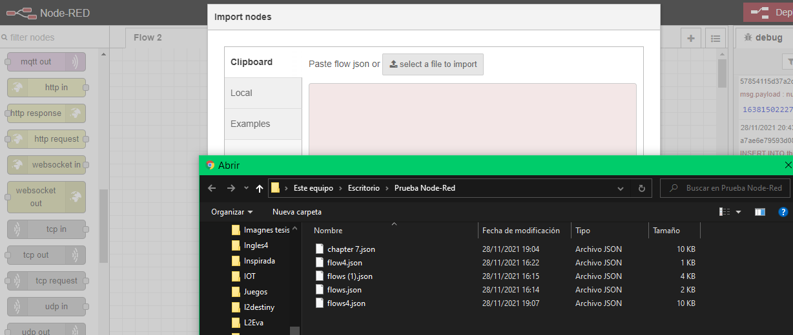
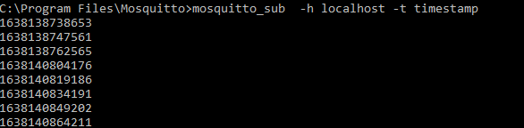
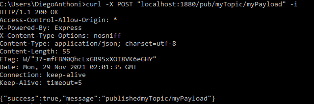
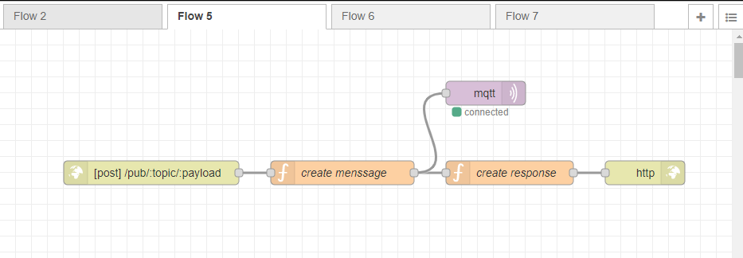
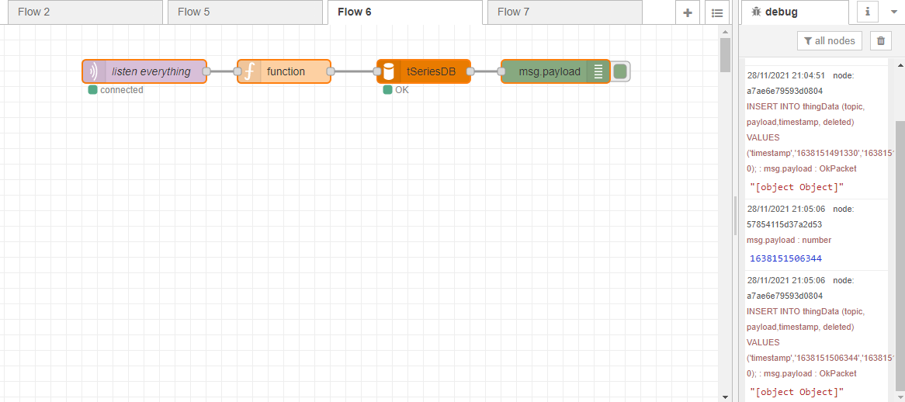
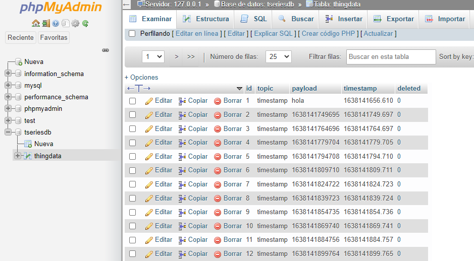
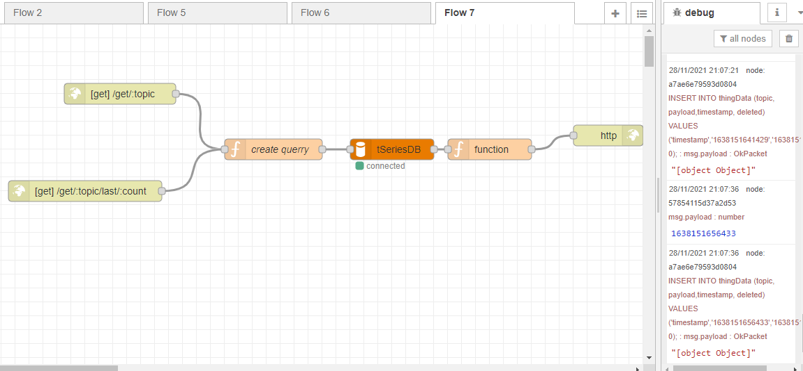
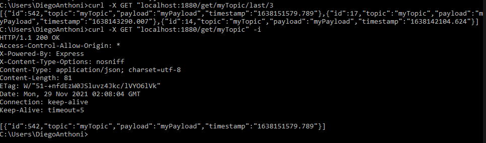

# IOT-2daActividad
 En esta practica se desarrollo el ejercicio propuesto en el Capítulo 7 (Building the Critical Components) del libro Build Your Own IoT Platform.

## Participantes 
- Diego Antony Gutierrez Gutierrez 

## Herramientas 
- [Docker Compose](https://www.docker.com/)
- [Node-Red](https://nodered.org/)
- [Mosquitto](https://mosquitto.org/)

## Ejecutando el proyecto
 
### Prerequisitos para correr desde docker
> Tener instalado docker en el computador

En esta parte se tuvo algunas dificultades al momento de instalar el mosquitto en el archivo docker compose.  Pero se pudo instalar con exito Node - Red, mysql y phpMyAdmin.

### Prerequisitos para correrlo localmente 

- Tener instaldo Mysql
- Tener phpMyAdmin
- Mosquitto 
- Node-Red

#### Importamos la base da datos

En nuestro directorio phpMyAdmin importamos el archivos tseriesdb .

 

#### Importamos a Node-Red
Ahora vamos importar nuestro json a nuestra plantilla en Node-Red.

 

### Resultados

#### Creando el primer flujo para nuestra plataforma

Resultados del primer ejemplo propuesto en el libro, en ese ejemplo se imprimia un mensaje cada 15 segundo, este mensaje se imprimira en el debug y en nuestrs consola mediante el mosquitto.

 

 

#### Publicador de mensajes de API REST

Resultados de segundo ejemplo del libro, el cual nos permite mandar mensajes apartir de nuestro protocolo HTTP.

 

 

#### Utilizando una BD

Resultados del tercer ejemplo, el cual nos permite alamacenar en nuestra BD todo lo que nuestro programa escucha.

 

 

#### Recuperador de mensajes de la API REST

Resultados del cuarto ejemplo, el cual nos servira para recuperar mensajes alamcenados en la base de datos.

 

 

